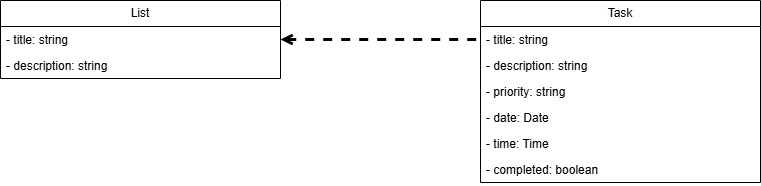
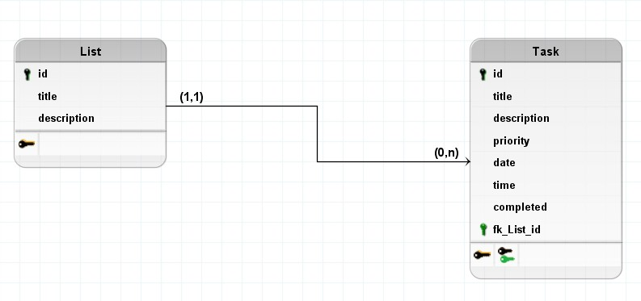

## Introdução
O documento de arquitetura de um projeto consiste em definir como será a estrutura do software que será produzido, isso engloba o padrão arquitetural que será utilizado, os serviços e ferramentas que serão utilizadas para desenvolvimento, dentre outros aspectos do projeto.

## Metodologia
Para criação deste documento de arquitetura de software, foram selecionados somente 3 artefatos para serem utilizados como guia do projeto em sua execução.  
O primeiro consiste na representação arquitetural do software, onde é detalhado como será a estrutura do projeto e os serviços que irão compor essa estrutura.  
O segundo artefato é o diagrama de classe que costuma ser utilizado para representar a estrutura do sistema, as classes que compõem esse sistema, seus atributos, métodos e relacionamentos entre elas.  
E por fim o terceiro artefato consiste no Diagrama lógico de dados, que é utilizado para entender as entidades do projeto e seus respectivos atributos, e como estas entidades se relacionam entre si, tudo isso dentro do contexto de um sistema de banco de dados.

## Representação Arquitetural
Para este projeto foi definido uma arquitetura em camadas, essa arquitetura irá consistir em 3 camadas, a de apresentação que irá ser a da interface do usuários (front-end) que será codificado usando o framework NexjJS, a camada de lógica de negócios que será a API de comunicação entre a interface e o banco de dados, onde a API será feita utilizando o framework Ruby on Rails, e a última camada será a de dados que é responsável por ter o sistema de banco de dados PostgreSQL. A seguir na imagem 1 temos a imagem do diagrama de relações:  

<figcaption>Imagem 1: Diagrama de Relações</figcaption>

## Diagrama de Classe
Para este projeto será utilizado duas classes para representar nossas entidades, onde Task é a representação das tarefas que serão cadastradas na aplicação, essa classe irá possuir o seguinte atributos: id, nome, descrição, data, horário e prioridade. E a segunda classe será a representação das nossas listas de task, chamada de List, onde os atributos dessa classe são: nome e descrição. A seguir na imagem 2 podemos ver a imagem do diagrama de classe:  

<figcaption>Imagem 2: Diagrama de Classe</figcaption>

## Diagrama Lógico de Dados
Ao analisar o projeto, identifica-se que o banco de dados irá possuir duas entidades, Task e List, que irão possuir uma relação entre elas onde a cardinalidade ficará 1:N nesta relação. A seguir na imagem 3 podemos ver o diagrama lógico de dados que mostra a estrutura do nosso banco de dados:

<figcaption>Imagem 3: Diagrama Lógico de Dados</figcaption>

